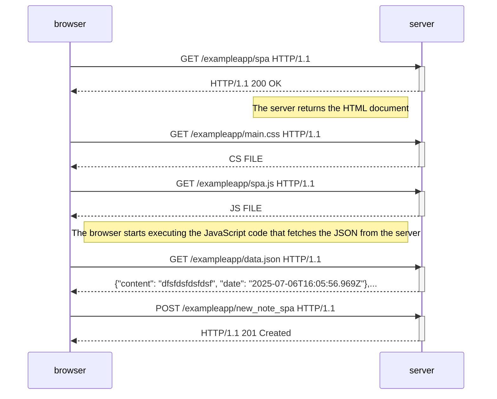

```mermaid
sequenceDiagram
participant browser
participant server

browser->>server: GET /exampleapp/spa HTTP/1.1
activate server 
server-->>browser: HTTP/1.1 200 OK
deactivate server

Note left of server: The server returns the HTML document

browser->>server: GET /exampleapp/main.css HTTP/1.1
activate server
server-->>browser: CS FILE
deactivate server

browser->>server: GET /exampleapp/spa.js HTTP/1.1
activate server
server-->>browser: JS FILE
deactivate server

Note right of browser: The browser starts executing the JavaScript code that fetches the JSON from the server

browser->>server: GET /exampleapp/data.json HTTP/1.1
activate server
server-->>browser: {"content": "dfsfdsfdsfdsf", "date": "2025-07-06T16:05:56.969Z"},...
deactivate server

browser->>server: POST /exampleapp/new_note_spa HTTP/1.1
activate server
server-->>browser: HTTP/1.1 201 Created
deactivate server
```